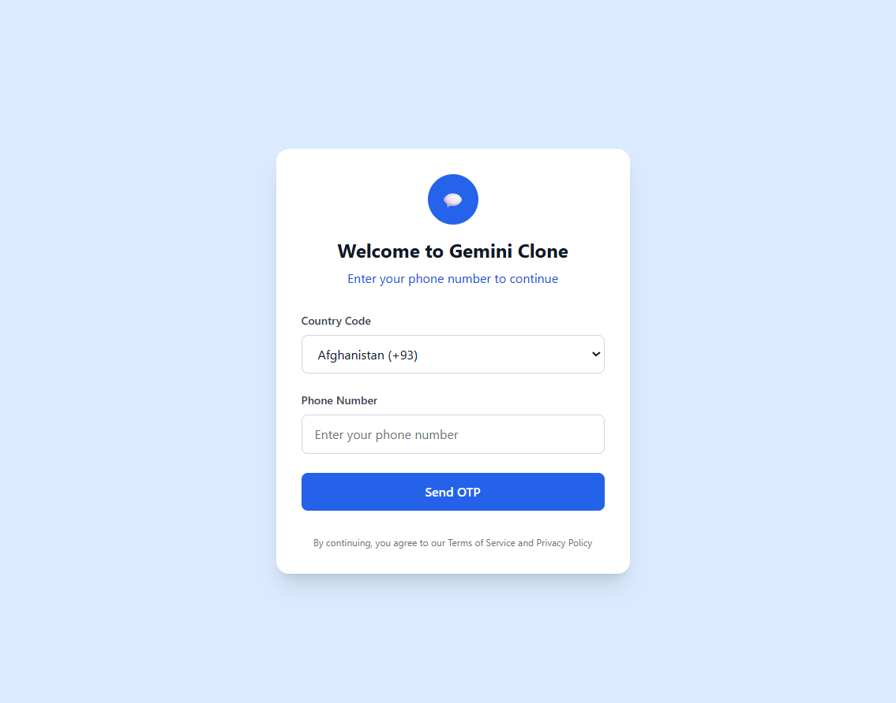
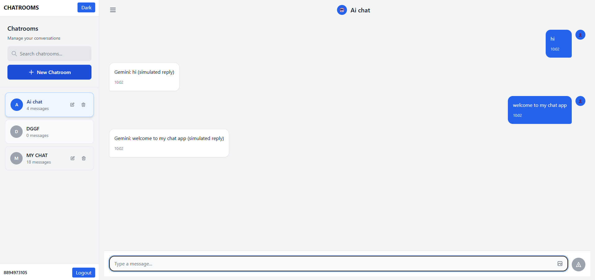
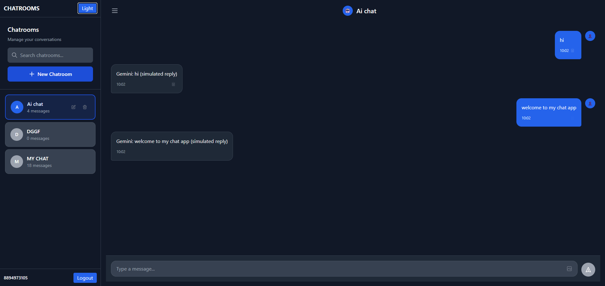
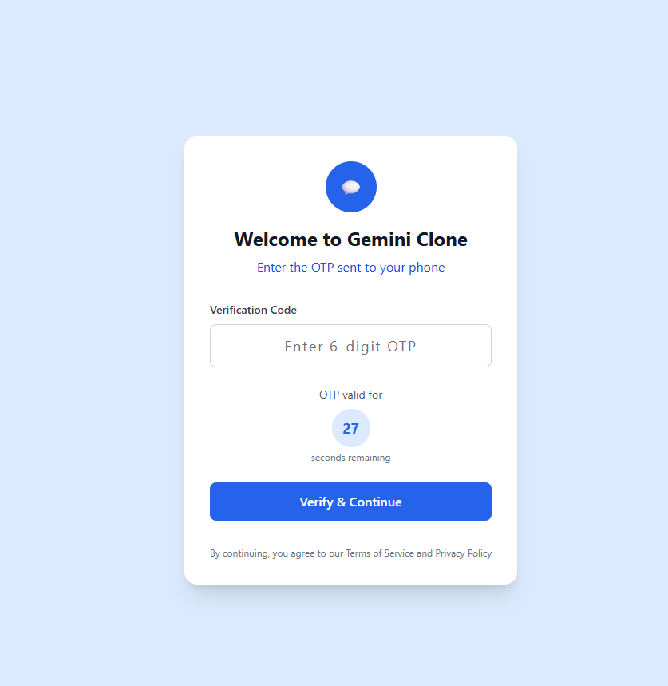

# Gemini Clone

A modern chat application built with React that mimics the Gemini AI interface. This project features a clean, responsive design with real-time chat simulation, user authentication, and intuitive chatroom management.

## Live Demo

[View Live Demo](https://your-deployed-link.com)

## Features

- **OTP-based Authentication**: Secure login with phone number verification and country code selection
- **Real-time Chat Interface**: Send messages and receive AI-simulated responses
- **Chatroom Management**: Create, delete, and switch between multiple chatrooms
- **Typing Indicators**: Visual feedback during AI response generation
- **Image Upload**: Preview and send images in chat
- **Dark Mode**: Toggle between light and dark themes
- **Responsive Design**: Works seamlessly on desktop and mobile devices
- **Message Copy**: Click any message to copy to clipboard
- **Auto-scroll**: Automatically scrolls to latest messages
- **Data Persistence**: Chat history saved locally

## Tech Stack

- **Frontend**: React 18, Vite
- **Styling**: Tailwind CSS
- **State Management**: Zustand
- **Form Handling**: React Hook Form + Zod validation
- **Notifications**: React Hot Toast
- **Icons**: Heroicons

## Setup and Installation

1. **Clone the repository**
   ```bash
   git clone https://github.com/yourusername/gemini-clone.git
   cd gemini-clone
   ```

2. **Install dependencies**
   ```bash
   npm install
   ```

3. **Start development server**
   ```bash
   npm run dev
   ```

4. **Open your browser**
   
   Navigate to `http://localhost:5173` (or the port shown in terminal)

## Project Structure

```
src/
├── components/
│   ├── Auth/
│   │   └── OTPForm.jsx          # Login/authentication form
│   ├── Chat/
│   │   ├── ChatroomView.jsx     # Main chat interface
│   │   ├── MessageInput.jsx     # Message input component
│   │   └── MessageList.jsx      # Message display list
│   ├── Dashboard/
│   │   └── ChatroomList.jsx     # Sidebar chatroom list
│   └── UI/
│       └── SkeletonMessage.jsx  # Loading skeleton
├── layouts/
│   └── ChatLayout.jsx           # Main app layout
├── store/
│   └── useStore.js              # Zustand state management
├── utils/
│   └── aiSimulator.js           # AI response simulation
├── App.jsx                      # Main app component
├── main.jsx                     # App entry point
└── index.css                    # Global styles
```

## Implementation Details

### Form Validation
Form validation is handled using React Hook Form combined with Zod schemas for type-safe validation. This ensures robust input validation for phone numbers, OTP codes, and chatroom names with real-time error feedback.

### Throttling
AI responses are throttled using setTimeout to simulate realistic response times (1.5 seconds). This prevents spam and creates a more natural chat experience.

### Pagination & Infinite Scroll
The app implements reverse infinite scroll for message history. Messages are loaded in pages of 20, with smooth scrolling behavior. This is handled client-side for optimal performance.

### State Management
Zustand is used for global state management with persistence middleware. User sessions, chatrooms, messages, and UI preferences are automatically saved to localStorage.

## Screenshots







